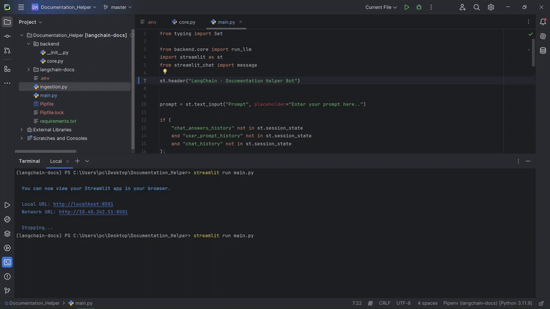

# Documentation Helper Bot

LangChain Documentation Helper Bot is an AI-powered assistant designed to help you query documentation and retrieve relevant information. Built with Streamlit, it features a chat-based interface for seamless interaction.

## Features

- **Supports Any Documentation**: Works with static files, dynamic web content, or APIs. (We use it here for Langchain , But we can use it to build any other documentation)
- **Interactive Chat Interface**: Users can input prompts and get AI-generated responses.
- **Sources Included**: The bot provides clickable source links for references.
- **Chat History**: Keeps a record of all interactions in the current session.
- **Flexible Backend**: Initially designed with static documentation but easily extensible for dynamic data loading with FireCrawl.
- **Pinecone Integration**: Index and query static documentation efficiently.

---

## How It Works

### Phase 1: Static Documentation with Pinecone
Initially, we started with **static documentation**:
1. The documentation was pre-processed and indexed into **Pinecone**, a vector database.
2. The bot queries Pinecone for relevant documentation sections to generate responses.

### Phase 2: Dynamic Documentation with FireCrawl
To enhance the bot's flexibility, we later integrated **FireCrawl**:
1. FireCrawl dynamically crawls web documentation and APIs, retrieving up-to-date content.
2. The retrieved data is fed into the bot, making it suitable for scenarios where static documentation is insufficient or frequently updated.

---

## Installation

1. Clone this repository:
   ```bash
   git clone https://github.com/your-repo/langchain-doc-helper.git
   cd langchain-doc-helper
   ```

2. Install required dependencies:
   ```bash
   pip install -r requirements.txt
   ```

3. Run the application:
   ```bash
   streamlit run app.py
   ```

---

## Usage

1. Launch the app.
2. Type a query in the prompt input field (e.g., "What is `PromptTemplate` in LangChain?").
3. View the AI's response along with source links.
4. Explore the chat history for previous interactions.

---

## Demo

Here’s a quick look at the LangChain Documentation Helper Bot in action:

<p align="center">
  
</p>


---

## FireCrawl Integration for Dynamic Data

### What is FireCrawl?
FireCrawl is a tool designed for web crawling and dynamic data extraction. It’s ideal for keeping the bot’s knowledge base up-to-date with real-time information.

### Transition from Static to Dynamic Data
- **Static Phase**: The bot used pre-indexed documentation in Pinecone, which was efficient but limited to static content.
- **Dynamic Phase**: FireCrawl enabled the bot to dynamically fetch documentation, such as API references or user guides, ensuring up-to-date and comprehensive responses.

### How to Use FireCrawl
1. Integrate FireCrawl into your backend.
2. Configure it to crawl specific websites, APIs, or documentation sources.
3. Process the retrieved data and feed it to your bot for enhanced capabilities.

---

## Contributing


We welcome contributions! If you want to adapt the bot for other documentation or suggest improvements, feel free to fork this repository and submit a pull request.


---

